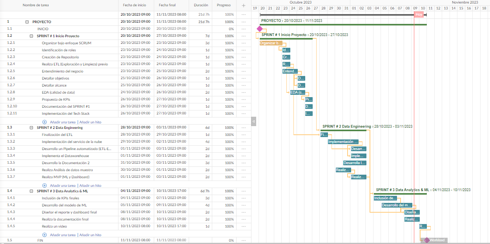
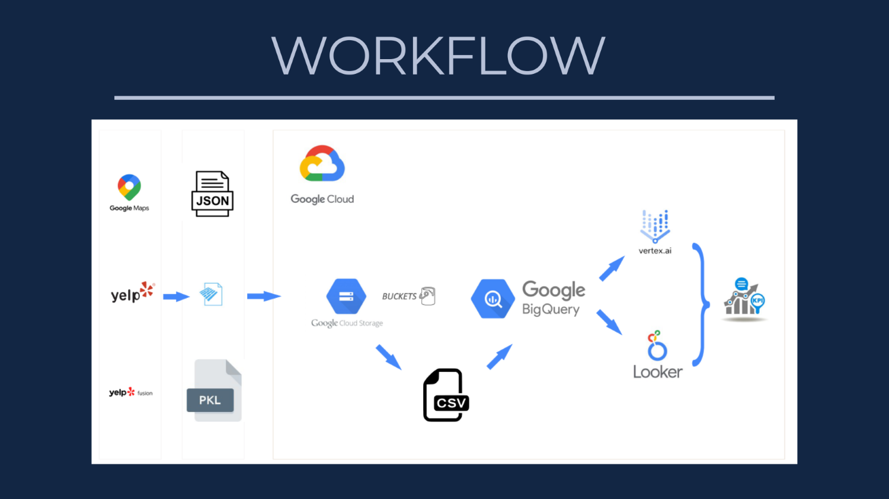
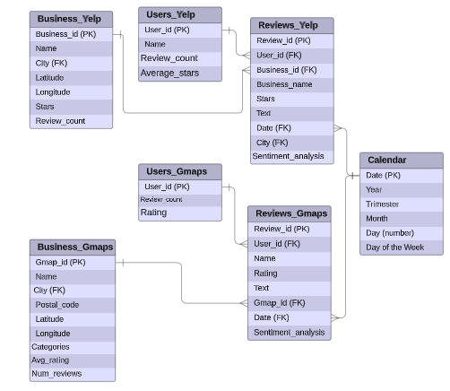

# Sistema de recomendación: Franquicias de fast - food

  

## Índice

- [Introducción](#Introducción)
- [Objetivos y alcances](#Objetivos_alcances)
- [Roles](#Roles)
- [ETL](#ETL)
- [Metodología de trabajo](#Metodologia)
- [Gestión de tareas](#Gestion)
- [Arquitectura](#Arquitectura)
- [Automatizacion](#Automatizacion)
- [Diagrama entidad - relación ](#Diagrama)
- [Indicadores claves de rendimiento y Panel de control](#KPIs)
- [Modelo de machine learning](#Modelo_ML)
- [Resultados y conclusiones](#Resultados-y-conclusiones)
- [Entregables](#entregables)

 

## Introducción

Somos una firma de consultoría especializada en análisis de datos, reconocida bajo el nombre de MINDFUL DATA. Nuestra labor se centra en el análisis de información procedente de plataformas de reseñas líderes. Nuestro principal objetivo radica en la identificación de patrones y tendencias en las opiniones de los usuarios, con el fin de lograr una comprensión más profunda de sus experiencias, necesidades y expectativas en relación a diversos servicios.

Este proyecto responde a la necesidad del inversor gastronómico proveniente del estado de Florida que planea instalar una franquicia de comida rápida en el estado y quiere que nuestra consultora realice un análisis de dos fuentes principales de información: las opiniones de los usuarios en Yelp y Google Maps para recomendarle qué franquicia de fast food le conviene adquirir y en qué lugar del estado de Florida ubicarla. 

 

## Objetivos y alcances

El objetivo de este proyecto es realizar un análisis del mercado estadounidense específicamente del estado de Florida en el sector de restaurantes de fast food. El cliente que nos ha contratado es un inversor que planea instalar una franquicia de comida rápida en Florida y quiere que nuestra consultora de datos (Mindful Data) realice un análisis de dos fuentes principales de información: las opiniones de los usuarios en Yelp y Google Maps para recomendarle qué franquicia de fast food le conviene adquirir. 

Para cumplir con este objetivo, nuestro equipo se ha propuesto las siguientes metas:

- Realizar un análisis de sentimientos y opiniones de las reseñas de Yelp y Google Maps para comprender la percepción de los usuarios sobre el sector fast food en Florida, Estados Unidos.

- Predicción del crecimiento o declive del sector fast food basándonos en datos históricos.

- Sistema de recomendación de restaurantes de fast food personalizado, eficiente que diversifica las franquicias.
 
Este proyecto se centrará en el análisis de las reseñas de los últimos 5 años de Yelp y Google Maps acerca de las cadenas de fast food más importantes de Florida, Estados Unidos, con el objetivo de identificar cuál es la mejor opción a la hora de adquirir una franquicia basado en un sistema de recomendación que tiene en cuenta la preferencia de los usuarios y las tendencias en las reseñas de locales de comida rápida en la ciudad de Florida. 

 

## Roles

Dentro de nuestra Mindful Data Solutions hemos definido el grupo de trabajo para darle a curso a este proyecto, y los roles a cumplir por cada uno de los integrantes del mismo.
Cabe mencionar, que como la metodología de trabajo es por etapas, los roles pueden verse sujetos a modificación en función de las necesidades del proyecto. 

 

 

## Metodología de trabajo

Se adopta la metodología de trabajo Scrum con entregas parciales sobre los avances del proyecto. 

- Semana 1: Esta etapa constituye la puesta en marcha del proyecto y el tratamiento de los datos. Se trazan los objetivos, los alcances del proyecto así como los KPIs a evaluar. Además, se realiza el EDA preliminar de los datos. 

- Semana 2: Etapa de Data Engineering. Se crea, se implementa y se automatiza el datawarehouse. Además, se plantean los MVPs del dashboard y de los modelos de Machine Learning preliminares.

- Semana 3: Etapa final. Se completa principalmente el dashboard y se presenta el producto de Machine Learning. Además se realiza la entrega de la documentación y del repositorio completo. 

 

## Gestión de las tareas

Para poder cumplir con los objetivos propuestos semanalmente, se fueron gestionando tareas con ayuda de Trello. Las tareas, su duración y fecha, su avance y porcentaje de completitud se presentan a continuación.

Para visualizar el diagrama de Gantt en la plataforma de Gantt Pro acceda al siguiente enlace:  [Diagrama de Gantt](https://app.ganttpro.com/shared/token/ab3fb6d8ff2139ab4a90ea4d8c8eb51207fa26c920bb6b58cd1f8acef0a2ea90/1265694)

 

## Arquitectura 

Optamos por Google Cloud como servicio en la nube para gestionar los datos, automatizar procesos y para el  procesamiento de aprendizaje automático :

- Cloud Storage Buckets como datalake
- Cloud Functions para realizar el ETL de los datos
- BigQuery, como datawarehouse para almacenar y procesar los datos.
- Python para implementar los modelos de aprendizaje.
- Tableau como herramienta de visualización de datos y KPIs.

 

El workflow del proceso se presenta a continuación:

 

## Automatización 
Para la automatizacion del proceso de ETL, implementamos Google Cloud Functions, al ingresar un archivo al Bucket indicado se inicia el proceso de ETL, que incluye la validacion, transformacion, limpieza y carga de datos al Data Warehouse en Big Query.

 

## Diagrama de entidad - relación
A continuación se presenta el diagrama entidad - relación del modelo presente en nuestro datawarehouse, Big Query. 

 

 

## Indicadores claves de rendimiento (KPIs) y Panel de control

A continuación se presentan los 5 KPIs propuestos y sus métricas asociadas.

 

A continuación se presenta el enlace al dashboard que se ha desarrollado con el propósito de proporcionar una visión en tiempo real de los datos clave que impulsarán las decisiones estratégicas del inversor. A través de una combinación de visualizaciones intuitivas, métricas esenciales y análisis detallados, nuestro objetivo es ofrecer un panorama completo y claro de la situación actual del proyecto.

Enlace al dashboard: [Panel de control](https://app-exzyyajzmkwgv3a7dos4qt.streamlit.app/)
 

## Modelo de Machine Learning

El Sistema de Recomendación se diseñó con los siguientes objetivos clave:

- Personalización: Proporcionar recomendaciones basadas en las preferencias de los usuarios y las tendencias de reseñas a través de los comentarios en la plataforma Yelp y Gmaps.
- Eficiencia: Optimizar el tiempo y los recursos de inversión al ofrecer recomendaciones precisas y relevantes.
- Diversificación de Franquicias: Fomentar la diversificación de franquicias en el mercado, proporcionando información sobre diferentes opciones.
- Análisis de Sentimientos: Incorporar análisis de sentimientos en las reseñas para comprender las experiencias de los usuarios

 

## Resultados y Conclusiones

En resumen, la creación de un Data Warehouse en GCP es un paso fundamental para desbloquear el potencial de sus datos. La carga inicial y la carga incremental son etapas cruciales para asegurar que los datos sean precisos, actualizados y listos para el análisis. Google Cloud Storage ofrece un conjunto de herramientas poderosas para llevar a cabo estas tareas de manera eficiente y confiable. Al invertir en la creación y el mantenimiento de su Data Warehouse, su organización estará en una posición sólida para tomar decisiones informadas y estratégicas basadas en datos precisos y oportunos. El cual dio la oportunidad para crear un dashboard que detecta posibilidades de inversión y rastrea la evolución de la satisfacción del cliente, lo que otorga una posición competitiva destacada en el mercado de comida rápida en Florida. Asimismo, un sistema de recomendación que tiene en cuenta las preferencias de los usuarios y las tendencias en las reseñas de locales de comida rápida

 

## Entregables

Los entregables de la semana 1 se encuentran en la carpeta Semana_1: 

- Tratamiento de datos previo al EDA preliminar: [Yelp.ipynb](Semana_1/Yelp.ipynb)  y [Google_maps.ipynb](Semana_1/Google_maps.ipynb)
- [EDA_preliminar.ipynb](Semana_1/EDA_preliminar.ipynb)
- [Informe](Semana_1/Informe.pdf)

Los entregables de la semana 2 se encuentran en la carpeta Semana_2: 

- ETL de los archivos en local:  [ETL_Yelp.ipynb](Semana_2/ETL_Yelp.ipynb), [ETL_gmaps.ipynb](Semana_2/ETL_Gmaps.ipynb)
- ETL Automatizado: [ETL Automatizado](Semana_2/ETL automatizado)
- [Informe](Semana_2/Informe.pdf) 

Los entregables de la semana 3 se encuentran en la carpeta Semana_3: 
- [Modelo de Machine Learning](Semana_3/Modelo_ML.pdf)
- [Streamlit](Semana_3/Streamlit)
- [Informe_final](Semana_3/Informe_final_.pdf)

 
