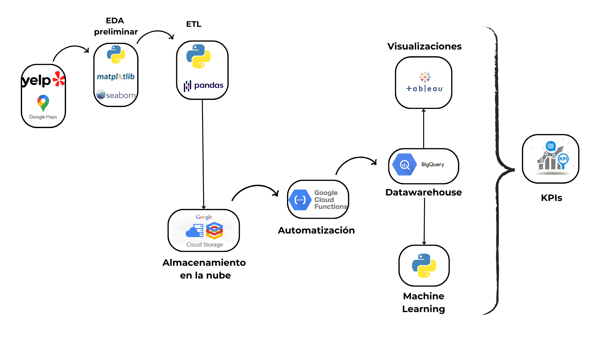
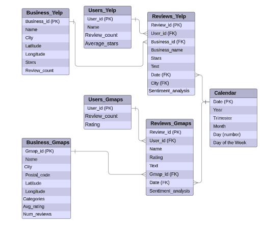

# Recommendation system: Fast Food Franchises

 

## Introducción

Somos una firma de consultoría especializada en análisis de datos, reconocida bajo el nombre de MINDFUL DATA. Nuestra labor se centra en el análisis de información procedente de plataformas de reseñas líderes. Nuestro principal objetivo radica en la identificación de patrones y tendencias en las opiniones de los usuarios, con el fin de lograr una comprensión más profunda de sus experiencias, necesidades y expectativas en relación a diversos servicios.

Este proyecto responde a la necesidad del inversor gastronómico proveniente del estado de Florida que planea instalar una franquicia de comida rápida en Florida y quiere que nuestra consultora realice un análisis de dos fuentes principales de información: Las opiniones de los usuarios en Yelp y Google Maps para recomendarle qué franquicia de fast food le conviene adquirir y en qué lugar del estado de Florida. 

 

## Objetivos

El objetivo de este proyecto es realizar un análisis del mercado estadounidense específicamente del estado de Florida en el sector de restaurantes de comida rápida. El cliente que nos ha contratado es un inversor que planea instalar una franquicia de comida rápida en Florida y quiere que nuestra consultora de datos (Mindful Data) realice un análisis de dos fuentes principales de información: las opiniones de los usuarios en Yelp y Google Maps para recomendarle qué franquicia de fast food le conviene adquirir. 
Para cumplir con este objetivo, nuestro equipo se ha propuesto las siguientes metas:

- Realizar un análisis de sentimientos y opiniones de las reseñas de Yelp y Google Maps para comprender la percepción de los usuarios sobre el sector fast food en Florida, Estados Unidos.

- Predicción del crecimiento o declive del sector fast food basándonos en datos históricos. Para ello, utilizaremos diferentes técnicas de machine learning.

- Sistema de recomendación de restaurantes de fast food.

- Recomendación de sitios para nuevos locales mediante un modelo de machine learning, se identifican las ciudades dentro del estado de Florida para emplazar nuevos locales del sector en función de reseñas positivas.

 

## Alcance

Este proyecto se centrará en el análisis de las reseñas de los últimos 5 años de Yelp y Google Maps acerca de las cadenas de fast food más importantes de Florida, Estados Unidos, con el objetivo de identificar cuál es la mejor opción a la hora de adquirir una franquicia y determinar en qué ciudad del estado de Florida conviene colocarla. 

 

## Roles

Dentro de nuestra Mindful Data Solutions hemos definido el grupo de trabajo para darle a curso a este proyecto, y los roles a cumplir por cada uno de los integrantes del mismo.
Cabe mencionar, que como la metodología de trabajo es por etapas, los roles pueden verse sujetos a modificación en función de las necesidades del proyecto. 

 

 

## Metodología de trabajo

Se adopta la metodología de trabajo Scrum con entregas parciales sobre los avances del proyecto. 

- Semana 1: Esta etapa constituye la puesta en marcha del proyecto y el tratamiento de los datos. Se trazan los objetivos, los alcances del proyecto así como los KPIs a evaluar. Además, se realiza el EDA preliminar de los datos. 

- Semana 2: Etapa de Data Engineering. Se crea, se implementa y se automatiza el datawarehouse. Además, se plantean los MVPs del dashboard y de los modelos de Machine Learning preliminares.

- Semana 3: Etapa final. Se completa principalmente el dashboard y se presenta el producto de Machine Learning. Además se realiza la entrega de la documentación y del repositorio completo. 

 

## Gestión de las tareas

Para poder cumplir con los objetivos propuestos semanalmente, se fueron gestionando tareas con ayuda de Trello. Las tareas, su duración y fecha, su avance y porcentaje de completitud se presentan en el siguiente enlace. 

[Diagrama de Gantt](https://app.ganttpro.com/shared/token/4fb6cd5fc6aea61fe85b23587efc279e50d1d4a2a198f16af78175ced20fd585/1250504#/)

 

## Análisis exploratorio de datos

 

En esta sección se realiza un primer análisis de los datos provistos por YELP y Google Maps. El objetivo de esta instancia es identificar los tipos de datos, conocer su calidad y los potenciales procesos de transformación a los que deberá ser sometida la data. Cabe mencionar, que en esta instancia no se intenta realizar un análisis exploratorio en profundidad, sino más bien tener un primer panorama de los dataset con su descripción general.  

 

El tratamiento de los datos previo al análisis exploratorio se presenta en los archivos: [Yelp.ipynb](Semana_1/Yelp.ipynb) y [Google_maps.ipynb](Semana_1/Google_maps.ipynb).

El análisis exploratorio de datos se presenta en el archivo: [EDA_preliminar.ipynb](Semana_1/EDA_preliminar.ipynb)

 

## Indicadores claves de rendimiento (KPIs)

A continuación se presentan los 5 KPIs propuestos y sus métricas asociadas.

 

## Arquitectura 

Optamos por Google Cloud como servicio en la nube para gestionar los datos, automatizar procesos y para el  procesamiento de aprendizaje automático :

- Cloud Storage Buckets como datalake
- Cloud Functions para realizar el ETL de los datos
- BigQuery, como datawarehouse para almacenar y procesar los datos.
- Vertex AI para  implementar los modelos de aprendizaje.
- Tableau como herramienta de visualización de datos y KPIs.

 

El workflow del proceso se presenta a continuación:

 

## Diagrama Entidad - Relación

A continuación se presenta el diagrama entidad - relación del modelo presente en Big Query. 

 

 

## Entregables

Los entregables de la semana 1 se encuentran en la carpeta semana_1: 

- Tratamiento de datos previo al EDA preliminar: [Yelp.ipynb](Semana_1/Yelp.ipynb)  y [Google_maps.ipynb](Semana_1/Google_maps.ipynb)
- [EDA_preliminar.ipynb](Semana_1/EDA_preliminar.ipynb)
- [Informe](Semana_1/Informe.pdf)
- [Presentacion](Semana_1/Presentacion.pdf)

Los entregables de la semana 2 se encuentran en la carpeta semana_2: 

- ETL de los archivos en local:  [ETL_yelp.ipynb](Semana_2/ETL_yelp.ipynb), [ETL_gmaps.ipynb](Semana_2/ETL_gmaps.ipynb).
- [Informe](Semana_2/Informe.pdf)
- [Presentacion](Semana_2/Presentacion.pdf)

